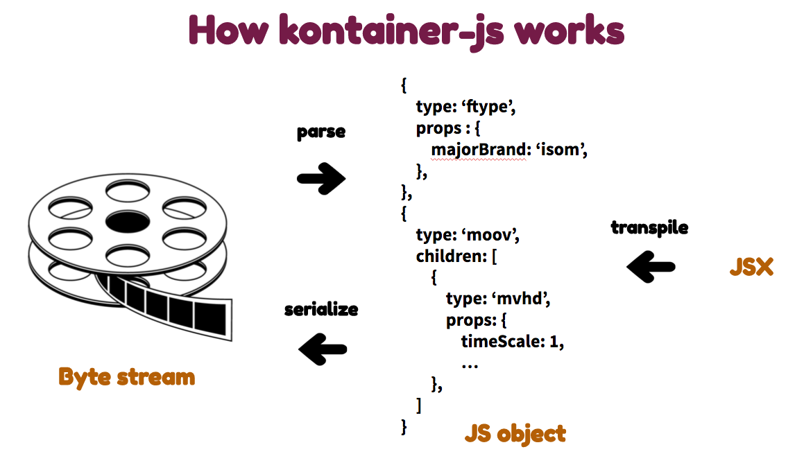

# Kontainer
A media file format generator/parser that exposes a React-like API. `kontainer-js` is available as an [npm package](https://www.npmjs.com/package/kontainer-js).
[](http://travis-ci.org/kuu/Kontainer)


Kontainer aims to fully support the MP4 (ISO Base Media file format: ISO/IEC 14496-12) and WebM file format. The library can be used on Node.js and in the browser.

## Install

[](https://nodei.co/npm/kontainer-js/)

## Overview



## API

A media file like MP4 and WebM is composed of nested objects. In Kontainer, each object, e.g. MP4 Box, is represented as a `KontainerElement` which is similar to the `ReactElement`.

The actual media data (audio and video chunks) and the metadata are represented as a `props` object and passed to the `KontainerElement` as its attributes.

```js
import Kontainer from 'kontainer-js';

export default class MP4 {

  constructor(width, height) {
    Kontainer.use('mp4'); // format (mp4|webm) needs to be set before any API call
    this.width = width;
    this.height = height;
  }

  render() {
    return (
    <file>
      <ftyp majorBrand="isom" />
      <moov>
        <mvhd creationTime={new Date()} modificationTime={new Date()} timeScale={1} nextTrackId={4} />
        <trak>
          <tkhd creationTime={new Date()} modificationTime={new Date()} trackId={1} width={this.width} height={this.height} />
          <mdia>
            ...
          </mdia>
        </trak>
      </moov>
    </file>
    );
  }
}
```

The above code can be transpiled into the calls to `createElement()` using [`babel`](https://babeljs.io/) and a dedicated [plugin](https://www.npmjs.com/package/babel-plugin-transform-kontainer-js).

```js
    // Kontainer.createElement()
    //   Accepts: type, props, children...
    //   Returns: KontainerElement
    return Kontainer.createElement('file', null,
      Kontainer.createElement('ftyp', {majorBrand: 'isom'}),
      Kontainer.createElement('moov', null,
        Kontainer.createElement('mvhd', {creationTime: new Date(0), modificationTime: new Date(), timeScale: 1, nextTrackId: 4}),
        Kontainer.createElement('trak', null,
          Kontainer.createElement('tkhd', {creationTime: new Date(0), modificationTime: new Date(), trackId: 1, width: 640, height: 480}),
          Kontainer.createElement('mdia', null,
            ...
            // KontainerElement can be a child of other elements to compose a large nested tree.
          )
        )
      )
    );
```

Once an element is obtained, it can be serialized into a byte stream using `render()`.

```js
    // Kontainer.render()
    //   Accepts: KontainerElement
    //   Returns: Buffer (in node) or ArrayBuffer (in browser) that contains a media stream
    buffer = Kontainer.render(element);
```

On the other hand, you can create a KontainerElement from a byte stream.

```js
    // Kontainer.createElementFromBuffer()
    //   Accepts: Buffer (in node) or ArrayBuffer (in browser) that contains a media stream [, offset=0]
    //   Returns: KontainerElement.
    element = Kontainer.createElementFromBuffer(buffer, offset);

```

You can also create your hook and process a byte stream progressively. (This works only for Node.js)

```js
  const input = fs.createReadStream('./test.mp4');
  const transform = Kontainer.transform((type, props, children) => {
    if (type === 'tkhd') {
      // Change video dimensions
      props.width /= 2;
      props.height /= 2;
    }
  });
  input.pipe(transform).pipe(process.stdout);
```

### JSX

To transpile JSX into `createElement()` calls together with your ES.next code, you need to install `babel` and its plugins.

```
$ npm install babel-cli
$ npm install babel-preset-es2015
$ npm install babel-plugin-transform-kontainer-js
```

Put a .babelrc file in the source directories that contain JSX.

```js
{
  "presets": ["es2015"],
  "plugins": ["transform-kontainer-js"]
}
```

Then use the `babel` command to transpile the code.

```
$ babel src/ -d dist/
```

See the [plugin code](https://github.com/kuu/babel-plugin-transform-kontainer-js) for the details.


## CLI

A simple parser for displaying the structure of a media file.

```
Usage:
    kontainer filePath [options]

Example:
    kontainer /path/to/file
    cat /path/to/file | kontainer

Options:
  -h, --help    Print help
  -v, --version Print version
```

## Development

```
// Install
$ git clone git@github.com:kuu/Kontainer.git
$ cd Kontainer
$ npm install

// Test
$ npm test

// Build client libs
$ npm run build
// --> ./lib/kontainer.deb.js (uncompressed with debug messages)
// --> ./lib/kontainer.js (uncompressed)
// --> ./lib/kontainer.min.js (compressed)
// --> ./lib/kontainer.map.js (source map)
```
